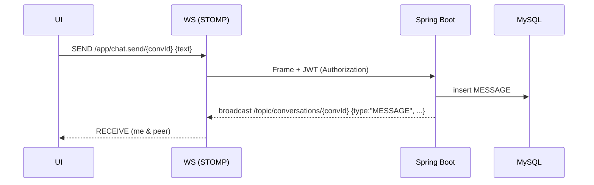

# Dingg — Realtime Chat Webapp

> Frontend: **Next.js 15.x**, **React 19**, **TypeScript**, **Tailwind CSS v4**
> Backend: **Java Spring Boot**, JWT, WebSocket (STOMP), JPA (MySQL)

## 🎯 Mục tiêu & MVP

* [x] Đăng ký/Đăng nhập (JWT)
* [x] Kết bạn (gửi/duyệt lời mời)
* [x] Nhắn tin 1–1
* [x] Realtime: gửi/nhận tin nhắn, **typing**, **read receipts**
* [x] Lưu lịch sử chat (**pagination/cursor**)
* [x] Trạng thái **online/offline (presence)**

> **Nguyên tắc:** REST cho CRUD & phân trang; **WebSocket** cho sự kiện realtime (message, typing, read, presence).

---

## 🏗️ Kiến trúc tổng quan

```mermaid
flowchart LR
  FE[Next.js 15 / React 19\nTailwind v4] -- REST/HTTPS --> API[Spring Boot REST API]
  FE -- WS (STOMP) --> WS[Spring WebSocket Endpoint /ws]
  API <-- JPA/Hibernate --> DB[(MySQL 8)]
  WS <-- Presence/Cache --> R[(Redis)*]
```

\* Redis tuỳ chọn cho presence/pub-sub; MVP có thể dùng in-memory trước.

* **Auth:** JWT (Access + Refresh). JWT dùng cho REST; với WS, gửi token ở `Authorization` header lúc handshake.
* **Realtime:** STOMP topics cho `message`, `typing`, `read`, `presence`.
* **Pagination:** cursor theo `createdAt` + `id` (ổn định, hiệu quả hơn page/offset).

---

## 📦 Tech Stack chi tiết

**Frontend**

* Next.js 15 (App Router), React 19, TypeScript
* Tailwind CSS v4
* State: Zustand / React Query (t tuỳ), Axios
* WS client: `@stomp/stompjs`
* Lint/Format: ESLint, Prettier

**Backend**

* Java 21+, Spring Boot 3.x
* Spring Security + JWT (jjwt/java-jwt)
* Spring WebSocket + STOMP
* Spring Data JPA (Hibernate) + MySQL Driver
* Validation, MapStruct, Lombok
* OpenAPI (`springdoc-openapi`) cho swagger UI
* (Tuỳ chọn) Redis cho presence/rate-limit

---

## 🗄️ Mô hình dữ liệu (ERD tối giản)

```mermaid
erDiagram
  USER ||--o{ FRIENDSHIP : has
  USER ||--o{ CONVERSATION_PARTICIPANT : participates
  CONVERSATION ||--o{ CONVERSATION_PARTICIPANT : includes
  CONVERSATION ||--o{ MESSAGE : has
  MESSAGE ||--o{ MESSAGE_RECEIPT : read_by

  USER {
    bigint id PK
    varchar username UNIQUE
    varchar email UNIQUE
    varchar passwordHash
    datetime createdAt
    datetime lastSeen
  }

  FRIENDSHIP {
    bigint id PK
    bigint requesterId FK -> USER.id
    bigint addresseeId FK -> USER.id
    enum status  "PENDING|ACCEPTED|BLOCKED"
    datetime createdAt
  }

  CONVERSATION {
    bigint id PK
    enum type "DIRECT|GROUP"
    datetime createdAt
  }

  CONVERSATION_PARTICIPANT {
    bigint id PK
    bigint conversationId FK -> CONVERSATION.id
    bigint userId FK -> USER.id
    datetime joinedAt
  }

  MESSAGE {
    bigint id PK
    bigint conversationId FK -> CONVERSATION.id
    bigint senderId FK -> USER.id
    text content
    varchar type "TEXT|IMAGE|FILE"
    datetime createdAt
  }

  MESSAGE_RECEIPT {
    bigint id PK
    bigint messageId FK -> MESSAGE.id
    bigint userId FK -> USER.id
    enum status "DELIVERED|READ"
    datetime updatedAt
  }
```

> **Note:** MVP tập trung **DIRECT** (1–1). GROUP có thể thêm sau.

---

## 🔌 API (REST) — phác thảo

```
POST   /api/auth/register
POST   /api/auth/login             -> { accessToken, refreshToken }
POST   /api/auth/refresh

GET    /api/users/me
GET    /api/users/search?q=...
GET    /api/friends                -> list bạn
POST   /api/friends/requests       -> {toUserId}
POST   /api/friends/requests/{id}/accept
DELETE /api/friends/{userId}

POST   /api/conversations          -> tạo DIRECT (từ friendId)
GET    /api/conversations
GET    /api/conversations/{id}/messages?limit=20&before=<cursor>

POST   /api/messages               -> (tuỳ chọn) gửi qua REST
```

**Pagination (cursor):**

* Response: `items[], nextCursor`
* Client gửi `before=nextCursor` để tải tiếp.

**OpenAPI:** `/swagger-ui` & `/v3/api-docs`

---

## 🔔 WebSocket (STOMP)

* Endpoint: `/ws`
* **Subscribe:**

  * `/topic/conversations/{conversationId}` (message + typing + read)
  * `/topic/presence` (broadcast presence cho friend list)
* **Send (app destinations):**

  * `/app/chat.send/{conversationId}` → gửi message
  * `/app/chat.typing/{conversationId}` → typing on/off
  * `/app/chat.read/{conversationId}` → read up to `messageId`
  * `/app/presence.ping` → keepalive (nếu cần)

**Message envelope (JSON)**

```json
{
  "type": "MESSAGE|TYPING|READ|PRESENCE",
  "conversationId": 123,
  "payload": {
    "text": "xin chào",
    "messageId": 456,
    "userId": 1,
    "isTyping": true,
    "status": "READ",
    "online": true
  },
  "ts": "2025-08-27T03:00:00Z"
}
```

**Sequence gửi tin nhắn**



---

## 📁 Cấu trúc dự án

**Frontend (Next.js 15, App Router)**

```
dingg-frontend/
├─ app/
│  ├─ layout.tsx
│  ├─ page.tsx              # danh sách cuộc trò chuyện
│  ├─ chat/[id]/page.tsx    # màn chat
├─ components/
│  ├─ chat/
│  │  ├─ MessageList.tsx
│  │  ├─ MessageInput.tsx
│  │  └─ TypingIndicator.tsx
│  ├─ ui/
├─ lib/
│  ├─ api.ts                # axios instance
│  ├─ auth.ts               # token helpers
│  └─ ws.ts                 # STOMP client
├─ store/
│  └─ chat.ts               # Zustand store
├─ middleware.ts            # (nếu cần bảo vệ route)
├─ tailwind.config.ts
├─ package.json
```

**Backend (Spring Boot)**

```
dingg-backend/
├─ src/main/java/com/dingg/
│  ├─ config/      # WebSecurityConfig, WebSocketConfig, OpenApiConfig
│  ├─ security/    # JwtFilter, JwtService, AuthEntryPoint
│  ├─ websocket/   # StompController, PresenceService
│  ├─ controller/  # REST controllers
│  ├─ service/     # business logic
│  ├─ repository/  # Spring Data JPA
│  ├─ dto/         # request/response DTOs
│  └─ entity/      # JPA entities
├─ src/main/resources/
│  └─ application.yml
└─ pom.xml
```

---

## 🔐 Bảo mật

* BCrypt cho mật khẩu
* JWT ký bằng HS256/RS256; refresh token rotation
* CORS chính xác theo domain FE
* Rate limit (tuỳ chọn với Redis)
* Kiểm tra quyền theo `conversationId` (participant-only)

---

## ⚙️ Biến môi trường

**Frontend (`.env.local`)**

```
NEXT_PUBLIC_API_URL=http://localhost:8080/api
NEXT_PUBLIC_WS_URL=ws://localhost:8080/ws
```

**Backend (`application.yml`)**

```yaml
server:
  port: 8080

spring:
  datasource:
    url: jdbc:mysql://localhost:3306/dingg?useSSL=false&characterEncoding=utf8
    username: root
    password: your_password
  jpa:
    hibernate:
      ddl-auto: update
    properties:
      hibernate.format_sql: true
      hibernate.jdbc.time_zone: UTC

security:
  jwt:
    secret: "superlong-secret-change-me"
    access-exp-minutes: 30
    refresh-exp-days: 7

cors:
  allowed-origins: "http://localhost:3000"
```

---

## 🚀 Chạy dev

**Yêu cầu:** Node 20+, pnpm, Java 21+, Maven, MySQL 8 (hoặc XAMPP)

**Frontend**

```bash
cd dingg-frontend
pnpm install
pnpm dev   # http://localhost:3000
```

**Backend**

```bash
cd dingg-backend
./mvnw spring-boot:run   # http://localhost:8080
```

---

## 🧪 Kiểm thử

* **Unit**: JUnit5, Mockito (service, security)
* **Integration**: SpringBootTest + Testcontainers (MySQL)
* **API**: Postman/Insomnia + Newman CI
* **E2E**: Playwright (luồng login, gửi/nhận, read/typing)

---

## 📈 Hiệu năng & mở rộng

* Index DB: `(conversationId, createdAt, id)` cho phân trang
* WebSocket: sticky-session khi scale ngang; chuyển sang broker relay (RabbitMQ/Kafka) khi tải lớn
* Presence: lưu Redis `presence:user:{id}` TTL; `lastSeen` ghi DB khi disconnect

---

## 🗺️ Roadmap đề xuất

* **Sprint 1**: Auth (JWT), model DB, CRUD bạn bè, tạo DIRECT conversation
* **Sprint 2**: WS (send/receive), UI chat cơ bản
* **Sprint 3**: Typing + Read receipts + Pagination
* **Sprint 4**: Presence + tối ưu UX + swagger + e2e

---

## 🧩 Snippet tham khảo

**WebSocket client (FE) — `lib/ws.ts`**

```ts
import { Client } from "@stomp/stompjs";

export const makeStompClient = (token: string) => {
  const client = new Client({
    brokerURL: process.env.NEXT_PUBLIC_WS_URL,
    connectHeaders: { Authorization: `Bearer ${token}` },
    reconnectDelay: 3000,
  });
  return client;
};
```

**WebSocket config (BE) — `WebSocketConfig.java`**

```java
@EnableWebSocketMessageBroker
@Configuration
public class WebSocketConfig implements WebSocketMessageBrokerConfigurer {
  @Override
  public void registerStompEndpoints(StompEndpointRegistry registry) {
    registry.addEndpoint("/ws").setAllowedOriginPatterns("*"); // set CORS chính xác trong prod
  }
  @Override
  public void configureMessageBroker(MessageBrokerRegistry registry) {
    registry.enableSimpleBroker("/topic");
    registry.setApplicationDestinationPrefixes("/app");
  }
}
```

---

## 📄 Giấy phép

MIT (tuỳ chọn)

---